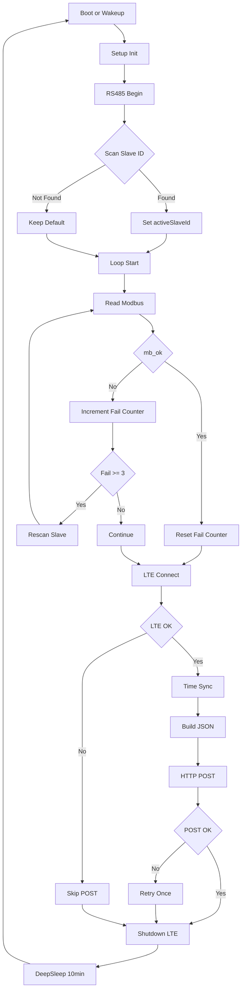

# Solar MPPT Monitor Gateway (Renogy Rover + ESP32 + LTE-M)

ESP32 と LTE-M モデムを用いて  
Renogy Rover MPPT チャージコントローラから RS485(Modbus RTU) でデータを取得し、  
HTTP(JSON) でサーバへ送信する遠隔監視ゲートウェイです。

---

## 📌 主な機能

- 10分周期の自動計測 + DeepSleep 省電力運用
- Modbus Slave ID 自動検出・再スキャン
- LTE-M(SIM7080G) 接続
- モデムからの時刻同期
- JSON 形式でサーバに POST
- RTC保持のシーケンス番号
- 再送制御（1回のみリトライ）
- サーバ側で認証・記録・可視化可能

---

## 🧱 システム構成
[ Renogy MPPT ]
|
RS485
|
[ ESP32 + SIM7080G ]
|
LTE
|
[ PHP Server ]
|
[ CSV / JSON / Viewer ]

---

## 📂 リポジトリ構成
.
├─ firmware/
│ ├─ devkit/
│ ├─ sim7080g_s3/
│ ├─ config_example.h
│ └─ README_firmware.md
│
├─ server/
│ └─ solar_mppt_monitor/
│ ├─ ingest.php
│ ├─ devices.example.json
│ └─ alert_recipients.example.json
│
├─ docs/
│ ├─ wiring.md
│ └─ flowchart.md
│
├─ .gitignore
└─ README.md

---

# 🔐 セキュリティ方針（重要）

このリポジトリには以下の **実値は含めません**：

- DEVICE_SECRET
- APN / USER / PASS
- 実運用URL
- devices.json / alert_recipients.json 本体

実運用時は：

- `config_example.h` → `config.h`
- `devices.example.json` → `devices.json`

にコピーして値を設定してください。

---

# 🔌 配線（概要）

## ESP32 DevKit

| 信号 | ピン |
|-----|------|
| RS485 RX | GPIO16 |
| RS485 TX | GPIO17 |
| LTE RX | GPIO26 |
| LTE TX | GPIO27 |
| LED_PWR | GPIO18 |
| LED_MB | GPIO19 |
| LED_LTE | GPIO21 |

---

## RS485 (U034)

- A/B を Renogy MPPT に接続
- 自動方向制御

---

## LTE モデム (SIM7080G)

- UART接続
- 5V 電源必須（電流余裕あり）

---

# 🔄 動作フロー（Mermaid）

🛠️ ビルド手順（ファーム）

1.Arduino IDE または PlatformIO を使用
2.firmware/devkit または sim7080g_s3 を開く
3.config_example.h をコピー
   config_example.h → config.h

以下を自分の値に設定：

#define DEVICE_SECRET "<YOUR_SECRET>"
#define POST_URL "http://example.com/ingest.php"
#define APN "<YOUR_APN>"

ESP32 に書き込み

🖥️ サーバ構築
必要条件

Linux + Apache / Nginx
PHP 8.x
書き込み権限のある data ディレクトリ

配置
/var/www/html/solar_mppt_monitor/
  ingest.php
  devices.json
  alert_recipients.json
example をコピー：

cp devices.example.json devices.json
cp alert_recipients.example.json alert_recipients.json

📜 ライセンス
本プロジェクトは OSS として公開されます。

🤝 貢献
Issue / Pull Request 歓迎します。
バグ報告
新機種対応
Viewer 改善
電源最適化
📷 注意

実フィールド運用時は：
SIM情報
などの公開に注意してください。
