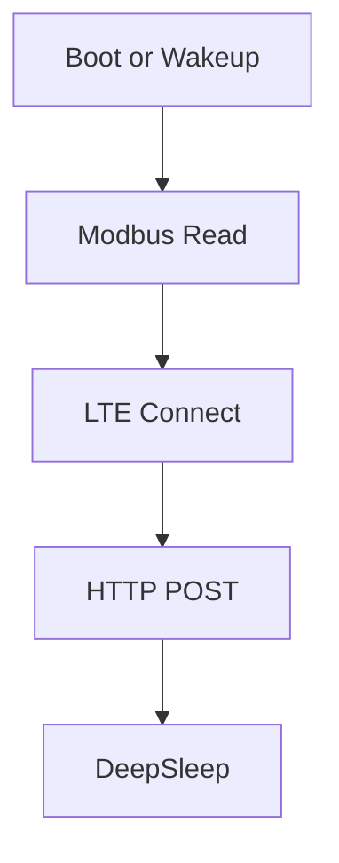

# Solar MPPT Monitor (Renogy Rover / ESP32 + LTE)

Two gateway firmwares and a simple server-side collector/viewer.

## What this repo contains

- `firmware/esp32devkit_sim7080g_u034/` : ESP32-DevKit + M5Stack SIM7080G Unit + RS485(U034)
- `firmware/tsim7080g_s3_u094_rs485iso/` : LilyGO T-SIM7080G-S3 + RS485-ISO(U094)
- `server/solar_mppt_monitor/` : PHP ingest API, watchdog, and a lightweight web viewer

## Security / secrets

This repository is a **public template**.
Please do **NOT** commit secrets such as device secrets, recipient emails, or server domains.

- Firmware secrets: put into `config.h` (copy from `firmware/config_example.h`).  
  `config.h` is ignored by `.gitignore`.
- Server configs: keep `server/solar_mppt_monitor/devices.json` and `alert_recipients.json` private.
  Example files are provided.

## Quick start (server)

1. Copy `server/solar_mppt_monitor/devices.example.json` to `devices.json` and edit secrets.
2. Copy `server/solar_mppt_monitor/alert_recipients.example.json` to `alert_recipients.json` and edit recipients.
3. Deploy the `server/solar_mppt_monitor/` directory to your web server.
4. Point firmware `POST_URL` to your `ingest.php`.

## Mermaid docs

You can embed flowcharts in Markdown with Mermaid blocks.

## License

Choose a license (e.g., MIT) and add `LICENSE`.
